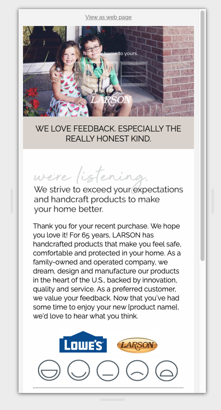

# Larson Doors

[Jira ticket REG-18799](https://registria.atlassian.net/browse/REG-18799)

## Three Review emails:

1. [Lowes & happy customer](https://scottbickell.github.io/18799-larson-doors-customer-reviews/01-happy-customer-lowes.html)
2. [Other retailer & happy customer](https://scottbickell.github.io/18799-larson-doors-customer-reviews/02-happy-customer-other.html)
3. [Any unhappy customer](https://scottbickell.github.io/18799-larson-doors-customer-reviews/03-unhappy-customer.html)

### 1\. Lowes & happy customer 

[Original version](https://scottbickell.github.io/18799-larson-doors-customer-reviews/01-happy-customer-lowes.html). The happy/sad face icons in the right column present issues when viewed on mobile devices. Specifically, the icons scale quite small and loose their visual weight in the design. Best practices call for a single column for content on mobile. When the icon bar is present on mobile about 20% of the screen real estate is lost by including that right column.

[Alternative version](https://scottbickell.github.io/18799-larson-doors-customer-reviews/01-happy-customer-lowes-alt.html). This eliminates the right icon column on mobile and moves the icon bar down, beneath the copy block.

I also added an alternative set of happy/sad icons because I think the original version are sort of strange looking because they don't have any eyes.

